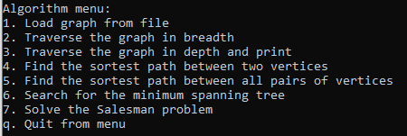

# GraphAlgorithms_CPP

Implementation of basic algorithms on graphs in C++.

# Development Details 

Implementation of the _s21_graph_ library:  
* The library is developed in C++ language of C++17 standard.
* The library is represented as a `Graph` class that stores information about the graph using an **adjacency matrix**. The dimensionality of the adjacency matrix is set dynamically when initializing the graph (when loading it from a file).
* The program is built with Makefile which contains standard set of targets for GNU-programs: _all, clean, test, s21_graph_.
*Prepared full coverage of the `Graph` class methods with unit-tests.
* The class `Graph` contains the following public methods:
    + `LoadGraphFromFile(string filename)` — loading a graph from a file in the adjacency matrix format.
    + `ExportGraphToDot(string filename)`- exporting a graph to a dot file (see materials).

Implementation of the _s21_graph_algorithms.h_ library:  
* The library is represented as a ` GraphAlgorithms ` class that stores the implementation of algorithms on graphs.
* The class ` GraphAlgorithms ` contain the following public methods:
    + `DepthFirstSearch(Graph &graph, int start_vertex)` — a *non-recursive* depth-first search in the graph from a given vertex.
    + `BreadthFirstSearch(Graph &graph, int start_vertex)` — breadth-first search in the graph from a given vertex. 
    + `GetShortestPathBetweenVertices(Graph &graph, int vertex1, int vertex2)` — searching for the shortest path between two vertices in a graph using *Dijkstra's algorithm*.
    + `GetShortestPathsBetweenAllVertices(Graph &graph)` — searching for the shortest paths between all pairs of vertices in a graph using the *Floyd-Warshall algorithm*.
    + `GetLeastSpanningTree(Graph &graph)` — searching for the minimal spanning tree in a graph using *Prim's algorithm*. 
    + `SolveTravelingSalesmanProblem(Graph &graph)` — solving the traveling salesman's problem using the *ant colony algorithm*.

Implementation of a console application for testing the functionality of the implemented s21_graph and s21_graph_algorithms libraries. 

* The console interface is provided the following functionality:
    1. Load the original graph from a file.
    2. Traverse the graph in breadth and print the result to the console.   
    3. Traverse the graph in depth and print the result to the console.
    4. Find the shortest path between any two vertices and print the result to the console.
    5. Find the shortest paths between all pairs of vertices in the graph and print the result matrix to the console.
    6. Search for the minimum spanning tree in the graph and print the resulting adjacency matrix to the console.
    7. Solve the Salesman problem, with output of the resulting route and its length to the console.